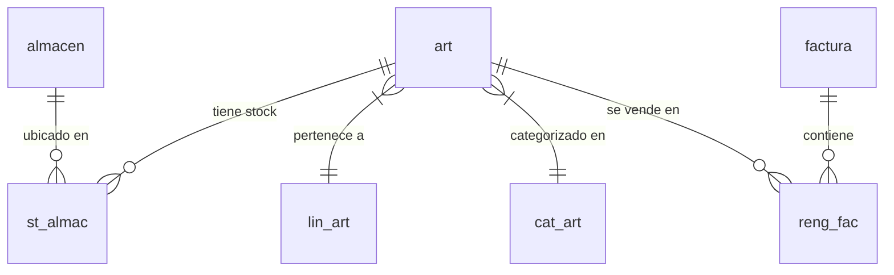

# Mapa Integral de Base de Datos - RWC20_A

Este documento detalla la estructura y relaciones de la base de datos Profit Plus.

## 1. Inventario de Tablas (Top 50 por volumen)
| Tabla                   |   Registros |
|:------------------------|------------:|
| lista_prov              |     2229346 |
| pistas                  |      669702 |
| equivalencia            |      253881 |
| reng_cob                |      141661 |
| docum_cc                |      132583 |
| reng_ped                |      132193 |
| mov_caj                 |      121564 |
| margenes                |      114399 |
| reng_tip                |      104606 |
| pedidos                 |       98221 |
| sf_historico_costos_art |       95898 |
| cobros                  |       92733 |
| reng_nde                |       90799 |
| reng_fac                |       76502 |
| not_ent                 |       62422 |
| reng_ord                |       48682 |
| reng_ndr                |       48277 |
| art                     |       41186 |
| factura                 |       38030 |
| clientes                |       35608 |
| mov_ban                 |       30903 |
| st_almac                |       26175 |
| reng_aju                |       22792 |
| reng_dp                 |       16778 |
| reng_pag                |       14008 |
| reng_com                |       13497 |
| docum_cp                |       11804 |
| ord_pago                |        9849 |
| reng_dvc                |        9136 |
| dev_cli                 |        7579 |
| ordenes                 |        6132 |
| not_rec                 |        6015 |
| reng_tcp                |        5649 |
| pagos                   |        5628 |
| dep_caj                 |        4091 |
| sf_vuelto               |        3886 |
| ajuste                  |        3548 |
| reng_cac                |        2634 |
| compras                 |        1993 |
| cotiz_c                 |        1873 |
| reng_tra                |        1492 |
| tasas                   |        1426 |
| cheques                 |        1200 |
| reng_art                |         791 |
| sf_margenes222          |         605 |
| sub_lin                 |         556 |
| sf_margenes             |         542 |
| cat_art                 |         540 |
| tras_alm                |         537 |
| prov                    |         504 |

## 2. Relaciones Detectadas (Dependencias)
| Tabla_Origen      | Columna_Origen   | Tabla_Destino   | Columna_Destino   |
|:------------------|:-----------------|:----------------|:------------------|
| pedidos           | co_ven           | vendedor        | co_ven            |
| plavent           | co_ven           | vendedor        | co_ven            |
| cobros            | co_ven           | vendedor        | co_ven            |
| cotiz_c           | co_ven           | vendedor        | co_ven            |
| dev_cli           | co_ven           | vendedor        | co_ven            |
| docum_cc          | co_ven           | vendedor        | co_ven            |
| factura           | co_ven           | vendedor        | co_ven            |
| not_dep           | co_ven           | vendedor        | co_ven            |
| not_ent           | co_ven           | vendedor        | co_ven            |
| clientes          | co_ven           | vendedor        | co_ven            |
| clientes          | co_zon           | zona            | co_zon            |
| prov              | co_zon           | zona            | co_zon            |
| plavent           | co_cli           | clientes        | co_cli            |
| rma_cli           | co_cli           | clientes        | co_cli            |
| rma_entc          | co_cli           | clientes        | co_cli            |
| cobros            | co_cli           | clientes        | co_cli            |
| cotiz_c           | co_cli           | clientes        | co_cli            |
| dev_cli           | co_cli           | clientes        | co_cli            |
| docum_cc          | co_cli           | clientes        | co_cli            |
| factura           | co_cli           | clientes        | co_cli            |
| not_dep           | co_cli           | clientes        | co_cli            |
| not_ent           | co_cli           | clientes        | co_cli            |
| sf_contacto       | co_cli           | clientes        | co_cli            |
| pedidos           | co_cli           | clientes        | co_cli            |
| chequeras         | cod_cta          | cuentas         | cod_cta           |
| conc_aut          | cod_cta          | cuentas         | cod_cta           |
| dep_caj           | cod_cta          | cuentas         | cod_cta           |
| mov_ban           | codigo           | cuentas         | cod_cta           |
| placom            | co_cli           | prov            | co_prov           |
| rma_entp          | co_prov          | prov            | co_prov           |
| rma_prov          | co_prov          | prov            | co_prov           |
| compras           | co_cli           | prov            | co_prov           |
| exp_imp           | co_age           | prov            | co_prov           |
| not_rec           | co_cli           | prov            | co_prov           |
| art               | co_prov          | prov            | co_prov           |
| cotiz_p           | co_cli           | prov            | co_prov           |
| docum_cp          | co_cli           | prov            | co_prov           |
| dev_pro           | co_cli           | prov            | co_prov           |
| ordenes           | co_cli           | prov            | co_prov           |
| pagos             | co_cli           | prov            | co_prov           |
| reng_emp          | emp_num          | Empaques        | emp_num           |
| Reng_tax          | Tax_id           | Tax             | Tax_id            |
| Reng_tax          | Tax_Num          | Tax_enc         | Tax_Num           |
| imp_mun           | co_alma          | almacen         | co_alma           |
| plavent           | co_sucu          | almacen         | co_alma           |
| ord_pago          | co_sucu          | almacen         | co_alma           |
| compras           | co_sucu          | almacen         | co_alma           |
| rentab            | co_sucu          | almacen         | co_alma           |
| sub_alma          | co_alma          | almacen         | co_alma           |
| not_rec           | co_sucu          | almacen         | co_alma           |
| turnosic          | co_sucu          | almacen         | co_alma           |
| cobros            | co_sucu          | almacen         | co_alma           |
| cotiz_c           | co_sucu          | almacen         | co_alma           |
| dep_caj           | co_sucu          | almacen         | co_alma           |
| dev_cli           | co_sucu          | almacen         | co_alma           |
| docum_cc          | co_sucu          | almacen         | co_alma           |
| docum_cp          | co_sucu          | almacen         | co_alma           |
| factura           | co_sucu          | almacen         | co_alma           |
| dev_pro           | co_sucu          | almacen         | co_alma           |
| fisico            | co_sucu          | almacen         | co_alma           |
| not_dep           | co_sucu          | almacen         | co_alma           |
| not_ent           | co_sucu          | almacen         | co_alma           |
| ordenes           | co_sucu          | almacen         | co_alma           |
| pagos             | co_sucu          | almacen         | co_alma           |
| ajuste            | co_sucu          | almacen         | co_alma           |
| ambtras           | co_sucu          | almacen         | co_alma           |
| pedidos           | co_sucu          | almacen         | co_alma           |
| spcierre          | odp_num          | spodp           | odp_num           |
| spentre           | odp_num          | spodp           | odp_num           |
| reng_odp          | odp_num          | spodp           | odp_num           |
| seriales          | co_alma          | sub_alma        | co_sub            |
| spcierre          | co_sub           | sub_alma        | co_sub            |
| spentre           | co_sub           | sub_alma        | co_sub            |
| tras_alm          | alm_orig         | sub_alma        | co_sub            |
| tras_alm          | alm_dest         | sub_alma        | co_sub            |
| gene_kit          | co_alma          | sub_alma        | co_sub            |
| reng_aju          | co_alma          | sub_alma        | co_sub            |
| reng_cac          | co_alma          | sub_alma        | co_sub            |
| reng_cdp          | co_alma          | sub_alma        | co_sub            |
| reng_com          | co_alma          | sub_alma        | co_sub            |
| reng_dvc          | co_alma          | sub_alma        | co_sub            |
| reng_dvp          | co_alma          | sub_alma        | co_sub            |
| reng_enc          | co_alma          | sub_alma        | co_sub            |
| reng_enp          | co_alma          | sub_alma        | co_sub            |
| reng_fac          | co_alma          | sub_alma        | co_sub            |
| reng_gen          | co_alma          | sub_alma        | co_sub            |
| reng_ndd          | co_alma          | sub_alma        | co_sub            |
| reng_nde          | co_alma          | sub_alma        | co_sub            |
| reng_ndr          | co_alma          | sub_alma        | co_sub            |
| reng_ord          | co_alma          | sub_alma        | co_sub            |
| reng_ped          | co_alma          | sub_alma        | co_sub            |
| reng_plc          | co_alma          | sub_alma        | co_sub            |
| reng_plv          | co_alma          | sub_alma        | co_sub            |
| reng_res          | co_alma          | sub_alma        | co_sub            |
| reng_rmc          | co_alma          | sub_alma        | co_sub            |
| reng_rmp          | co_alma          | sub_alma        | co_sub            |
| st_almac          | co_alma          | sub_alma        | co_sub            |
| st_lote           | co_alma          | sub_alma        | co_sub            |
| fisico            | co_alma          | sub_alma        | co_sub            |
| art               | co_subl          | sub_lin         | co_subl           |
| art               | co_lin           | sub_lin         | co_lin            |
| cheques           | Co_Chra          | chequeras       | Co_Chra           |
| reng_ace          | co_art           | art             | co_art            |
| spced             | co_art           | art             | co_art            |
| aranc             | co_art           | art             | co_art            |
| gene_kit          | co_art           | art             | co_art            |
| cost_imp          | co_art           | art             | co_art            |
| kit               | co_art           | art             | co_art            |
| lote              | co_art           | art             | co_art            |
| reng_aju          | co_art           | art             | co_art            |
| reng_art          | co_art           | art             | co_art            |
| reng_cac          | co_art           | art             | co_art            |
| reng_aco          | co_art           | art             | co_art            |
| reng_cdp          | co_art           | art             | co_art            |
| reng_aim          | co_art           | art             | co_art            |
| reng_cie          | co_art           | art             | co_art            |
| reng_com          | co_art           | art             | co_art            |
| reng_ara          | co_art           | art             | co_art            |
| reng_dcc          | co_art           | art             | co_art            |
| reng_dcp          | co_art           | art             | co_art            |
| reng_dvc          | co_art           | art             | co_art            |
| reng_dvp          | co_art           | art             | co_art            |
| reng_enc          | co_art           | art             | co_art            |
| reng_enp          | co_art           | art             | co_art            |
| reng_ent          | co_art           | art             | co_art            |
| reng_fac          | co_art           | art             | co_art            |
| reng_fis          | co_art           | art             | co_art            |
| reng_gen          | co_art           | art             | co_art            |
| reng_kit          | co_art           | art             | co_art            |
| reng_ndd          | co_art           | art             | co_art            |
| reng_nde          | co_art           | art             | co_art            |
| reng_ndr          | co_art           | art             | co_art            |
| reng_odp          | co_art           | art             | co_art            |
| reng_ord          | co_art           | art             | co_art            |
| reng_ped          | co_art           | art             | co_art            |
| reng_plc          | co_art           | art             | co_art            |
| reng_plv          | co_art           | art             | co_art            |
| reng_res          | co_art           | art             | co_art            |
| reng_rmc          | co_art           | art             | co_art            |
| art_ext           | co_art           | art             | co_art            |
| reng_rmp          | co_art           | art             | co_art            |
| reng_tra          | co_art           | art             | co_art            |
| st_almac          | co_art           | art             | co_art            |
| st_lote           | co_art           | art             | co_art            |
| reng_con          | cod_cta          | conc_aut        | cod_cta           |
| reng_con          | mes              | conc_aut        | mes               |
| reng_con          | ano              | conc_aut        | ano               |
| reng_ara          | co_conv          | conv_imp        | co_conv           |
| cuentas           | co_banco         | bancos          | co_ban            |
| par_conc          | co_ban           | bancos          | co_ban            |
| ord_pago          | cod_ben          | benefici        | cod_ben           |
| reng_doc          | exp_num          | exp_imp         | exp_num           |
| reng_emb          | exp_num          | exp_imp         | exp_num           |
| mov_caj           | codigo           | cajas           | cod_caja          |
| reng_dp           | codigo           | cajas           | cod_caja          |
| exp_imp           | imp_num          | import          | imp_num           |
| reng_aco          | imp_num          | import          | imp_num           |
| reng_aim          | imp_num          | import          | imp_num           |
| art               | co_cat           | cat_art         | co_cat            |
| hist_plan         | co_plan          | plan_fis        | co_plan           |
| art               | co_color         | colores         | co_col            |
| r_imp_co          | fact_nu2         | reng_aco        | imp_num           |
| r_imp_co          | reng_nu2         | reng_aco        | reng_num          |
| r_imp_co          | fact_nu1         | reng_aim        | imp_num           |
| r_imp_co          | reng_nu1         | reng_aim        | reng_num          |
| reng_tab          | co_islr          | con_islr        | co_islr           |
| reng_isl          | co_islr          | con_islr        | co_islr           |
| conc_ban          | cod_cta          | reng_con        | cod_cta           |
| conc_ban          | mes              | reng_con        | mes               |
| conc_ban          | ano              | reng_con        | ano               |
| conc_ban          | reng_num         | reng_con        | Reng_num          |
| placom            | forma_pag        | condicio        | co_cond           |
| plavent           | forma_pag        | condicio        | co_cond           |
| compras           | forma_pag        | condicio        | co_cond           |
| not_rec           | forma_pag        | condicio        | co_cond           |
| cotiz_c           | forma_pag        | condicio        | co_cond           |
| cotiz_p           | forma_pag        | condicio        | co_cond           |
| dev_cli           | forma_pag        | condicio        | co_cond           |
| factura           | forma_pag        | condicio        | co_cond           |
| dev_pro           | forma_pag        | condicio        | co_cond           |
| not_dep           | forma_pag        | condicio        | co_cond           |
| not_ent           | forma_pag        | condicio        | co_cond           |
| ordenes           | forma_pag        | condicio        | co_cond           |
| pedidos           | forma_pag        | condicio        | co_cond           |
| mov_caj           | cta_egre         | cta_ingr        | co_ingr           |
| ord_pago          | cta_egre         | cta_ingr        | co_ingr           |
| prov              | co_ingr          | cta_ingr        | co_ingr           |
| reng_opg          | cta_egre         | cta_ingr        | co_ingr           |
| dep_caj           | cta_egre         | cta_ingr        | co_ingr           |
| mov_ban           | cta_egre         | cta_ingr        | co_ingr           |
| clientes          | co_ingr          | cta_ingr        | co_ingr           |
| sub_lin           | co_lin           | lin_art         | co_lin            |
| art               | co_lin           | lin_art         | co_lin            |
| placom            | moneda           | moneda          | co_mone           |
| mov_caj           | moneda           | moneda          | co_mone           |
| plavent           | moneda           | moneda          | co_mone           |
| rma_entc          | moneda           | moneda          | co_mone           |
| rma_entp          | moneda           | moneda          | co_mone           |
| compras           | moneda           | moneda          | co_mone           |
| gene_kit          | moneda           | moneda          | co_mone           |
| import            | co_mone          | moneda          | co_mone           |
| reng_aco          | moneda           | moneda          | co_mone           |
| reng_aim          | moneda           | moneda          | co_mone           |
| tasas             | co_mone          | moneda          | co_mone           |
| not_rec           | moneda           | moneda          | co_mone           |
| cobros            | moneda           | moneda          | co_mone           |
| cotiz_c           | moneda           | moneda          | co_mone           |
| cotiz_p           | moneda           | moneda          | co_mone           |
| dep_caj           | moneda           | moneda          | co_mone           |
| dev_cli           | moneda           | moneda          | co_mone           |
| docum_cc          | moneda           | moneda          | co_mone           |
| docum_cp          | moneda           | moneda          | co_mone           |
| factura           | moneda           | moneda          | co_mone           |
| dev_pro           | moneda           | moneda          | co_mone           |
| fisico            | moneda           | moneda          | co_mone           |
| mov_ban           | moneda           | moneda          | co_mone           |
| not_dep           | moneda           | moneda          | co_mone           |
| not_ent           | moneda           | moneda          | co_mone           |
| ordenes           | moneda           | moneda          | co_mone           |
| pagos             | moneda           | moneda          | co_mone           |
| ajuste            | moneda           | moneda          | co_mone           |
| pedidos           | moneda           | moneda          | co_mone           |
| art               | procedenci       | proceden        | cod_proc          |
| conc_ban          | mov_num          | mov_ban         | mov_num           |
| reng_enc          | co_reem          | rma_reem        | co_reem           |
| reng_rmc          | co_reem          | rma_reem        | co_reem           |
| reng_enp          | co_reem          | rma_reep        | co_reem           |
| reng_rmp          | co_reem          | rma_reep        | co_reem           |
| reng_res          | rma_num          | rma_res         | rma_num           |
| reng_rmc          | co_revi          | rma_revi        | co_revi           |
| prov              | co_seg           | segmento        | co_seg            |
| clientes          | co_seg           | segmento        | co_seg            |
| reng_rmc          | rma_num          | rma_cli         | rma_num           |
| reng_enc          | rma_num          | rma_entc        | rma_num           |
| reng_atb          | co_atriv         | spatriv         | co_atriv          |
| reng_atc          | co_atriv         | spatriv         | co_atriv          |
| reng_enp          | rma_num          | rma_entp        | rma_num           |
| reng_ace          | co_ced           | spced           | co_ced            |
| reng_atc          | co_ced           | spced           | co_ced            |
| reng_ece          | co_ced           | spced           | co_ced            |
| reng_gce          | co_ced           | spced           | co_ced            |
| reng_mce          | co_ced           | spced           | co_ced            |
| spodp             | co_ced           | spced           | co_ced            |
| reng_rmp          | rma_num          | rma_prov        | rma_num           |
| reng_cos          | cost_num         | spcostest       | cost_num          |
| reng_cie          | ent_num          | spcierre        | ent_num           |
| reng_ece          | co_emp           | spemple         | co_emp            |
| reng_ent          | ent_num          | spentre         | ent_num           |
| reng_esc          | esc_num          | spescena        | esc_num           |
| reng_exp          | reng_num         | spexplosion     | exp_num           |
| reng_exp2         | exp_num          | spexplosion     | exp_num           |
| spparmaq          | co_falla         | spfalla         | co_falla          |
| reng_gce          | co_gas           | spgasfab        | co_gas            |
| sf_contacto_email | id_contacto      | sf_contacto     | id_contacto       |
| sf_contacto_tlf   | id_contacto      | sf_contacto     | id_contacto       |
| st_lote           | co_art           | lote            | co_art            |
| st_lote           | nro_lote         | lote            | nro_lote          |
| reng_imp          | inp_num          | spimplosion     | inp_num           |
| reng_tar          | co_maq           | spmaq           | co_maq            |
| spparmaq          | co_maq           | spmaq           | co_maq            |
| reng_men          | men_num          | spmenenc        | men_num           |
| reng_pla          | pla_num          | spplanenc       | pla_num           |
| reng_atb          | co_tar           | sptar           | co_tar            |
| reng_mce          | co_tar           | sptar           | co_tar            |
| reng_tar          | co_tar           | sptar           | co_tar            |
| reng_aim          | fact_num         | reng_com        | fact_num          |
| reng_aim          | reng_doc         | reng_com        | reng_num          |
| reng_cac          | tipo_imp         | tabulado        | tipo              |
| reng_dvc          | tipo_imp         | tabulado        | tipo              |
| art               | tipo_imp         | tabulado        | tipo              |
| reng_fac          | tipo_imp         | tabulado        | tipo              |
| reng_ndd          | tipo_imp         | tabulado        | tipo              |
| reng_ped          | tipo_imp         | tabulado        | tipo              |
| docum_cc          | tipo             | tabulado        | tipo              |
| docum_cp          | tipo             | tabulado        | tipo              |
| reng_rmc          | co_tec           | tecnico         | co_tec            |
| reng_aju          | tipo             | tipo_aju        | co_tipo           |
| clientes          | tipo             | tipo_cli        | tip_cli           |
| prov              | tipo             | tipo_pro        | tip_pro           |
| plavent           | co_tran          | transpor        | co_tran           |
| rma_prov          | co_tran          | transpor        | co_tran           |
| cotiz_c           | co_tran          | transpor        | co_tran           |
| dev_cli           | co_tran          | transpor        | co_tran           |
| factura           | co_tran          | transpor        | co_tran           |
| not_dep           | co_tran          | transpor        | co_tran           |
| not_ent           | co_tran          | transpor        | co_tran           |
| pedidos           | co_tran          | transpor        | co_tran           |
| turnosic          | co_turno         | turnos          | co_turno          |
| reng_emb          | co_uni           | unidades        | co_uni            |
| art               | uni_venta        | unidades        | co_uni            |
| art               | suni_venta       | unidades        | co_uni            |

## 3. Diagrama Visual (Entidad-Relación)

